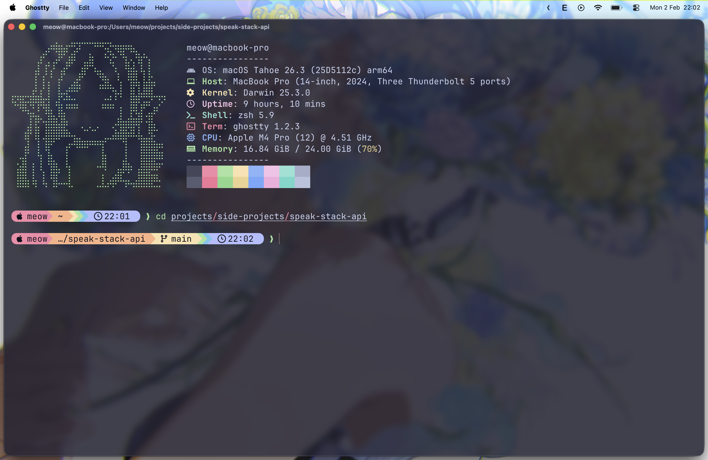

# dotfiles

My personal dotfiles managed with [GNU Stow](https://www.gnu.org/software/stow/).




## What's included

- **zsh** - Shell config with aliases, Starship prompt, syntax highlighting
- **ghostty** - Terminal emulator config
- **starship** - Cross-shell prompt
- **bat** - Cat with syntax highlighting
- **fastfetch** - System info display
- **git** - Git config

## Install

```bash
# Install Homebrew first: https://brew.sh

git clone https://github.com/meowlet/dotfiles.git ~/dotfiles
cd ~/dotfiles
./install.sh
```

## Requirements

- macOS
- [Homebrew](https://brew.sh)
